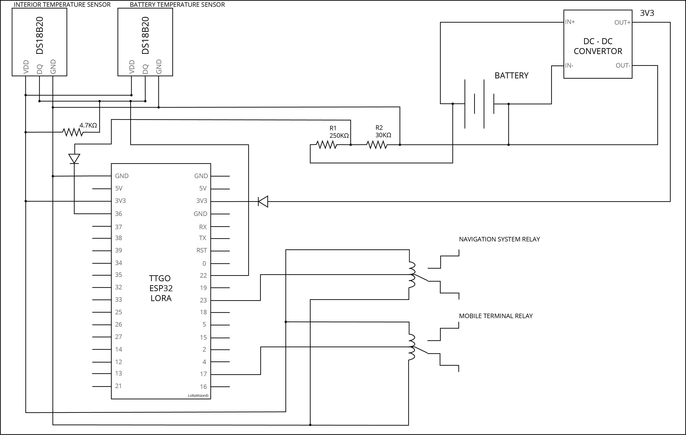
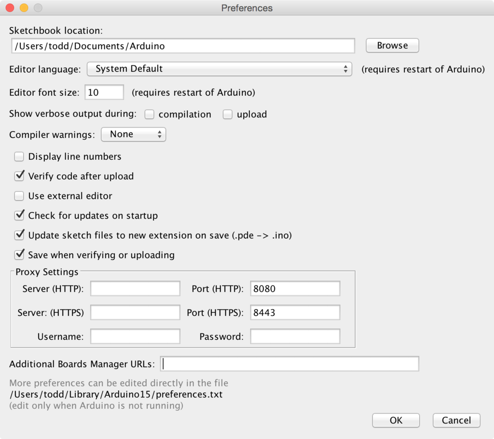
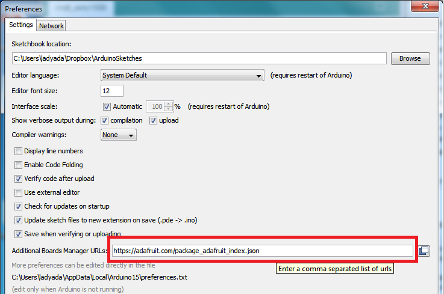
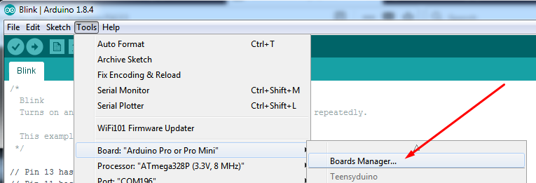
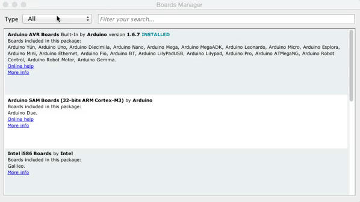
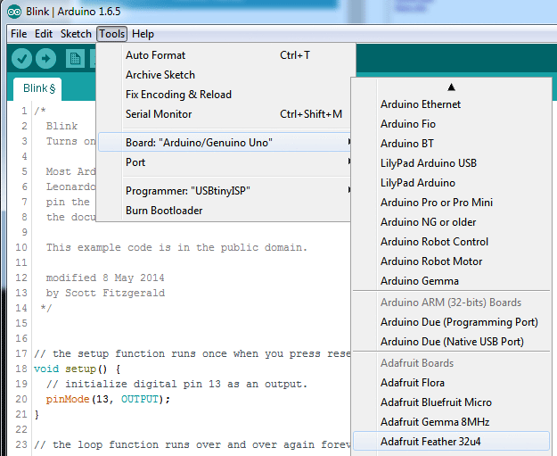

# LoRaVisionHardware

This project was split up into 3 subgroups one of them being hardware which is comprised of:
1. Costandino Hiripis
2. Christof Du Toit
3. Isaac Semackor

These three individial worked as a team to design, build, code and document the assignment provided by Adri Wischmann.

## Assignment
FILLMEIN

### Components
From this assignment above the three individials derived a list of components which include: 
- DS18B20
- Resistors
- Buck Convertor
- Relay

Each component serves a different purpose as descibed in the chapters below

#### DS18B20

#### Resistors

#### Buck Convertor

#### Relay

## Design
Within this phase the team used thier knowledge acquired from the research phase to create a visulaization of the circuit in order to ensure the smooth progression of the build phase.

### Visualization

## Arduino IDE Setup
The first step you will need to do is to download the latest verison of the Arduino IDE (**Version 1.8 or higher**).
You can download the Arduino IDE with the following link: http://www.arduino.cc/en/Main/Software

After you have downloaded and installed the **latest version of Arduino IDE**, you will need to start the IDE and navigate to the **Preferences** menu. You can access it from the File menu in Windows or Linux, or the **Arduino** menu on OS X.

A dialog will pop up just like the one shown below.

Copy and paste the link below into the **Additional Boards Manager URLs** option in the Arduino IDE preferences. 
`https://adafruit.github.io/arduino-board-index/package_adafruit_index.json`

You will only need to add one URL to the IDE in this example, but you can add multiple URLS by separating them with commas. 

Once done click **OK** to save the new preference settings. Next we will look at installing boards with the Board Manager.

Now that you have added the appropriate URLs to the Arduino IDE preferences, you can open the **Boards Manager** by navigating to the **Tools->Board** menu.

Once the Board Manager opens, click on the category drop down menu on the top left hand side of the window and select **Contributed**. You will then be able to select and install the boards supplied by the URLs added to the prefrences. In the example below, we are installing support for ***Adafruit AVR Boards***, but the same applies to all boards installed with the Board Manager.

Next, **quit and reopen the Arduino IDE** to ensure that all of the boards are properly installed. You should now be able to select and upload to the new boards listed in the **Tools->Board** menu.

### Blink

Now you can upload your first blink sketch!

Plug in the Feather 32u4 and wait for it to be recognized by the OS (just takes a few seconds). It will create a serial/COM port, you can now select it from the dropdown, it'll even be 'indicated' as Feather 32u4!

Now load up the code in the src directory!

### References
https://randomnerdtutorials.com/installing-the-esp32-board-in-arduino-ide-windows-instructions/
