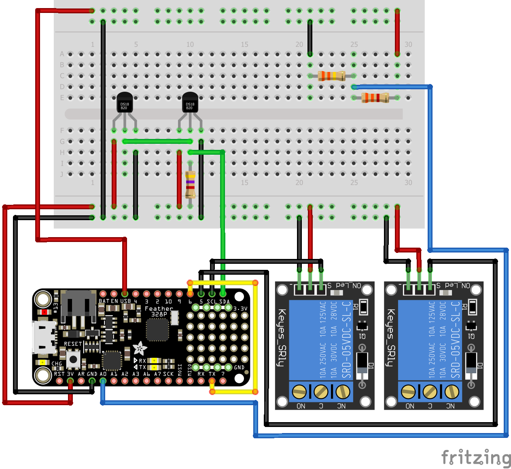

# LoRaVisionHardware

This project was split up into 3 subgroups one of them being hardware which is comprised of:
1. Costandino Hiripis
2. Christof Du Toit
3. Isaac Semackor

These three individial worked as a team to design, build and code the assignment provided by Adri Wischmann.

## Assignment

### Design
Within this phase the team used thier knowledge acquired from the research phase to create a visulaization of the circuit in order to ensure the smooth progression of the build phase.

## Visualization

