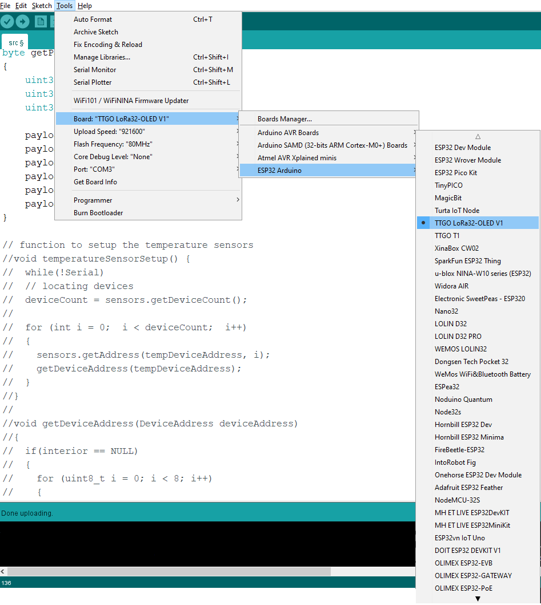
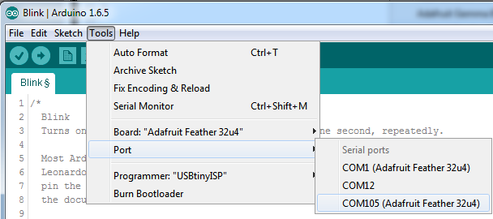

# LoRaVisionHardware

This project was split up into 3 subgroups one of them being hardware which is comprised of:
1. Costandino Hiripis
2. Christof Du Toit
3. Isaac Semackor

These three individial worked as a team to design, build, code and document the assignment provided by Adri Wischmann.

### Components
From this assignment above the three individials derived a list of components which include: 
- TTGO ESP32
- DS18B20
- Resistors
- Buck Convertor
- Relay

Each component serves a different purpose as descibed in the chapters below

### TTGO ESP32

The esp32 is a micro-controller board that is used to receive data from the sensors, trigger relays and is also used to send sensor data to the backend, the action being taken (reset communication, navigation, or both) is also displayed on the board’s display for convenience.

#### DS18B20

The DS18B20 digital thermometer provides 9-bit to 12-bit Celsius temperature measurements and is used in conjunction to the esp32.

#### Resistors

The resistors used in the voltage divider circuit is used to lower the voltage of the car battery so it can be read by the esp32 without damaging the board.

#### Buck Convertor

The buck converter is used to power the esp32 board off the car battery so it can be a standalone system, it will provide the board with 3.3V.

#### Relay

The two separate relays used will be how the system resets the communication and navigation devices via a signal from the website.

## Design
Within this phase the team used their knowledge acquired from the research phase to create a visualization of the circuit in order to ensure the smooth progression of the build phase.

### Visualization

## Arduino IDE Setup
The first step you will need to do is to download the latest version of the Arduino IDE (**Version 1.8 or higher**).
You can download the Arduino IDE with the following link: http://www.arduino.cc/en/Main/Software

After you have downloaded and installed the **latest version of Arduino IDE**, you will need to start the IDE and navigate to the **Preferences** menu. You can access it from the File menu in Windows or Linux, or the **Arduino** menu on OS X.

A dialog will pop up just like the one shown below.

Copy and paste the link below into the **Additional Boards Manager URLs** option in the Arduino IDE preferences. 
`https://dl.espressif.com/dl/package_esp32_index.json, http://arduino.esp8266.com/stable/package_esp8266com_index.json`

Once done click **OK** to save the new preference settings. Next we will look at installing boards with the Board Manager.

Now that you have added the appropriate URLs to the Arduino IDE preferences, you can open the **Boards Manager** by navigating to the **Tools->Board** menu.

Once the Board Manager opens, search for esp32 and click install. In the example below, we are installing support for ***esp32***, but the same applies to all boards installed with the Board Manager.

Next, **quit and reopen the Arduino IDE** to ensure that all of the boards are properly installed. You should now be able to select and upload to the new boards listed in the **Tools->Board** menu.

### Uploading code

Plug in the TTGO ESP32 and wait for it to be recognized by the OS (just takes a few seconds). It will create a serial/COM port, you can now select it from the dropdown.

Now load up the code from the src directory!

### References
https://randomnerdtutorials.com/installing-the-esp32-board-in-arduino-ide-windows-instructions/
